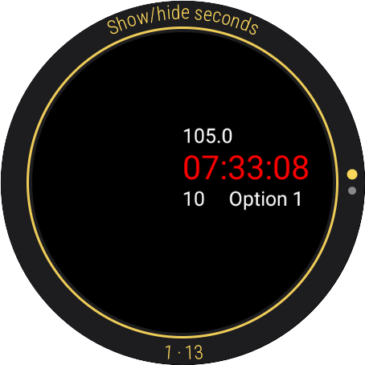
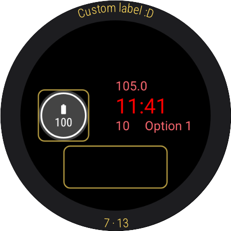
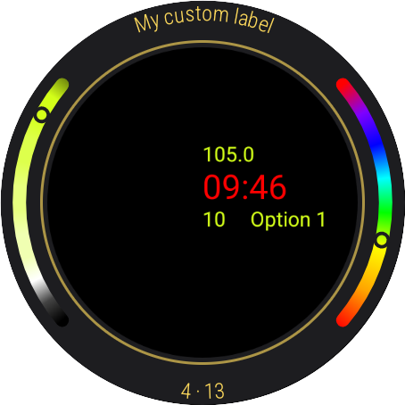
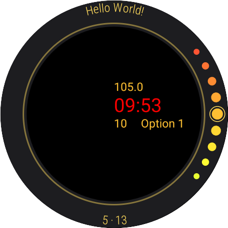
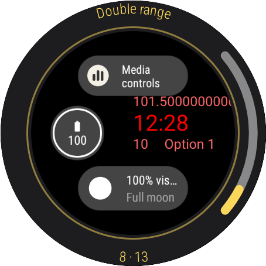
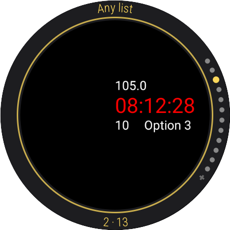

# Watch Face Editor :: WFE

A library for building Wear OS watch faces editors/customizers, that uses the Jetpack Watch Face API!
 
 

 
<h2>Documentation</h2>

See the [**documentation**](https://hms-douglas.github.io/wfe) for implementation, details and general use of WFE.

 
<h2>Donations</h2>

If you would like to support me, you can use one of the options bellow... Thank you! :heart:
 
 

 

 Coin | Address
----|----|
Bitcoin | 3NkK4LMwMhKefe2phqf7Vrp1uQynu1Gs6x
Ethereum | 0xfea5dd21ebf73c5b4a2445c7713f6b5316dfac4d
 
<h2>License</h2>
Copyright 2023 Douglas Silva

Licensed under the Apache License, Version 2.0 (the "License"); you may not use this library except in compliance with the License. You may obtain a copy of the License at

http://www.apache.org/licenses/LICENSE-2.0

Unless required by applicable law or agreed to in writing, software distributed under the License is distributed on an "AS IS" BASIS, WITHOUT WARRANTIES OR CONDITIONS OF ANY KIND, either express or implied. See the License for the specific language governing permissions and limitations under the License.
